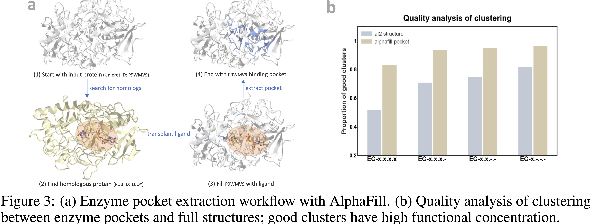

# EnzymeFlow: Generating Reaction-specific Enzyme Catalytic Pockets through Flow-Matching and Co-Evolutionary Dynamics

## Model


### Model Training on Enzyme Pocket Dataset

### Model Sampling Pockets


## Data


### 1. Enzyme Pocket and Substrate, Product Molecule Rawdata
   
   $~~~~$ (a) [molecule_structures folder](https://github.com/WillHua127/EnzymeFlow/tree/main/data/molecule_structures) in ```./data``` contain all substrate and product molecules, can be downloaded at link.
   
   $~~~~$ (b) [pocket_fixed_residues/pdb_10A folder](https://github.com/WillHua127/EnzymeFlow/tree/main/data/pocket_fixed_residues/pdb_10A) in ```./data``` contain all enzyme pockets, can be downloaded at link.

   $~~~~$ (c) In this github, we provide [rawdata](https://github.com/WillHua127/EnzymeFlow/blob/main/data/rawdata_cutoff-0.4.csv) and [metadata](https://github.com/WillHua127/EnzymeFlow/blob/main/data/metadata_cutoff-0.4.csv) with 40% homologys in ```./data``` folder. More rawdata can be downloaded at link.


### 2. Co-evolution and MSA
   
   $~~~~$ (a) [rxn_to_smiles_msa.pkl](https://github.com/WillHua127/EnzymeFlow/blob/main/data/rxn_to_smiles_msa.pkl) in ```./data``` contain reaction MSAs.
   
   $~~~~$ (b) [uid_to_protein_msa.pkl](link) in ```./data``` contain enzyme MSAs, can be downloaded at link.

   $~~~~$ (c) [vocab.txt](https://github.com/WillHua127/EnzymeFlow/blob/main/data/vocab.txt) in ```./data``` is co-evolution vocabulary.


### When the raw enzyme pockets, molecules, co-evolution data are ready, then

### 3. Process rawdata into metadata by running ```process_data.py```.
   
   $~~~~$ (a) Remember to change the configs ```--rawdata_file_name```, e.g., ```python process_data.py --rawdata_file_name rawdata_cutoff-0.4.csv```. Warning: we have absolute path in ```metadata.csv```, so you might need to change it to your path.

   
### 4. Processed Metadata.

   $~~~~$ (a) Processed data will be saved into ```./data/processed``` folder, with:
   
   $~~~~$ (b) processed enzyme in ```./data/processed/protein``` folder.

   $~~~~$ (c) processed substrate in ```./data/processed/ligand``` folder.

   $~~~~$ (d) processed co-evolution in ```./data/processed/msa``` folder.

   $~~~~$ (e) processed produuct in ```./data/processed/product``` folder.

   $~~~~$ (f) a toy [example](https://github.com/WillHua127/EnzymeFlow/tree/main/data/processed) is provided.


### 5. Evaluation Sample.
   
   $~~~~$ (a) We provide [eval-rawdata](https://github.com/WillHua127/EnzymeFlow/blob/main/data/eval-data_cutoff-0.1_unique-subs-enz_100.csv) and [eval-metadata](https://github.com/WillHua127/EnzymeFlow/blob/main/data/metadata_eval.csv) in ```./data``` folder. Warning: we have absolute path in metadata.csv, so you might need to change it to your path.

   $~~~~$ (b) We provide [unprocessed-eval-data](https://github.com/WillHua127/EnzymeFlow/tree/main/data/raw_eval_data) in ```./data/raw_eval_data``` folder.

   $~~~~$ (c) We provide [processed-eval-data](https://github.com/WillHua127/EnzymeFlow/tree/main/data/processed_eval) in ```./data/processed_eval``` folder.

   $~~~~$ (d) You can process evaluation data by running ```process_data.py```. Remeber to change the configs, e.g., ```python process_data.py --rawdata_file_name eval-data_cutoff-0.1_unique-subs-enz_100.csv --metadata_file_name metadata_eval.csv```.


## Further Statistics


